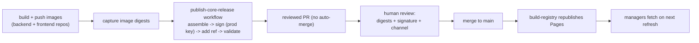
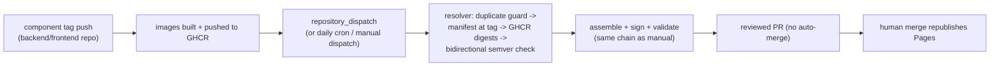
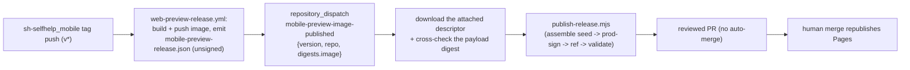

# Publishing to the registry

Audience: Plugin authors, platform release engineers, and registry maintainers.
Status: active.
Applies to: `sh2-plugin-registry`.
Last verified: 2026-06-23.
Source of truth: `scripts/build-plugin-release.mjs`, `scripts/sign.mjs`, `scripts/sign-release.mjs`, `scripts/assemble-release.mjs`, `scripts/publish-release.mjs`, `scripts/add-release-ref.mjs`, `scripts/validate-unified.mjs`, `.github/workflows/build-registry.yml`, `.github/workflows/publish-core-release.yml`, `.github/workflows/auto-core-release.yml`, and `.github/workflows/auto-mobile-preview-release.yml`.

> Just want the ordered, copy-paste release steps? Read the
> [release runbook](release-runbook.md) first — this page is the full
> reference behind it.

This is the **one official SelfHelp registry**. It publishes two kinds of signed
content from the same `registry.json`, and **both** are now the SAME release-ref
contract — `registry.json` holds an index of release refs (`{id, version,
channel, releaseUrl}`) that point at standalone signed release documents:

- **Plugins** — multi-version: a plugin appears as **one ref per published
  version** under `plugins[]`, each pointing at a signed
  `releases/plugins/<id>-<version>.json` (schema: `plugin-release.schema.json`),
  with the `.shplugin` install artifact + canonical `plugin.json` alongside (see
  [Adding or updating a plugin](#adding-or-updating-a-plugin)).
- **Platform releases** — signed **core**, **frontend**, **scheduler**,
  **worker**, and **mobile-preview** release metadata consumed by the SelfHelp
  Manager (`sh-manager`) (see
  [Publishing a platform release](#publishing-a-platform-release)). The
  `selfhelp-mobile-preview` image (the Expo web export served behind the CMS for
  in-browser mobile preview) is published with the same chain; its extra fields
  and auto-staging are documented in
  [reference/mobile-preview-release.md](../reference/mobile-preview-release.md).

Both use the same canonical-JSON + Ed25519 trust model (see
[signing.md](signing.md)) and the same trusted-keys file. The registry layout and
the full field reference live in
[reference/registry-layout.md](../reference/registry-layout.md).

## Adding or updating a plugin

A plugin author runs the `scripts/publish-to-registry.mjs` script shipped with the plugin (for example the SurveyJS plugin's `scripts/publish-to-registry.mjs` at <https://github.com/humdek-unibe-ch/sh2-shp-survey-js>). That script:

1. Builds the plugin's `.shplugin` archive locally (`scripts/build-shplugin.mjs`).
2. Computes the SHA-256 of the `.shplugin` (the install artifact the backend downloads + checksum-verifies).
3. Calls this repo's `scripts/build-plugin-release.mjs`, which maps the manifest onto the release axes (`compatibility.selfhelp` → `compatibility.core`, `pluginApiVersion` → `compatibility.pluginApi`, `security.trustLevel` → `official`), pins the archive sha256, and emits an **unsigned** plugin-release document (validated against `plugin-release.schema.json`).
4. Ed25519-signs that document in place with `scripts/sign-release.mjs` (production key from `SELFHELP_SIGNING_KEY`/`…_KEY_ID`, else the deterministic dev key) → `releases/plugins/<plugin-id>-<version>.json`.
5. Copies `plugin.json` to `manifests/<plugin-id>-<version>.json`, copies the `.shplugin` to `artifacts/<plugin-id>-<version>.shplugin`, and adds the release **ref** to `registry.json` `plugins[]` (multi-version: keeps every other version, replaces only the same id+version).
6. Commits and pushes the registry change (the workflow on this repo republishes GitHub Pages) and runs `gh release create v<version> dist/<plugin-id>-<version>.shplugin --notes-file CHANGELOG.md` so the `.shplugin` is also attached as a release asset for offline installs.

After the GitHub Pages job finishes, every host with the `humdek-public` source enabled sees the new plugin in its **Available** tab on the next refresh. Because the registry now carries one ref per version, the CMS resolves the **newest version compatible with that host** (`@selfhelp/shared` `PluginRelease` + the backend `PluginReleaseResolver`), not just the latest overall.

## Publishing a platform release

The manager installs **core**, **frontend**, **scheduler**, and **worker** from
this registry. Each is published as an **independently versioned, separately
pinnable** signed release document, so an instance can pin a distinct version of
each. No artifacts are built here — published images are pulled by the manager;
this registry only serves the signed **metadata**.

### 1. Write the release document

Create `releases/<kind>/<id>.json` (`<kind>` is `core`, `frontend`, `scheduler`,
or `worker`) and fill it against the matching schema
(`core-release.schema.json`, `frontend-release.schema.json`,
`scheduler-release.schema.json`, `worker-release.schema.json`). A release carries:

- its `id`, `version`, and `channel` (`stable` / `beta` / `nightly` / `test`; `test` is the staging/rehearsal channel served from a non-public registry, never `stable` without a real production key);
- the image reference(s) the manager pins (with digests);
- **checksums** for any fetched artifacts;
- compatibility metadata — for frontend/scheduler/worker a
  `backendCompatibility.requiredCoreRange` (and optional `requiredApiVersion`)
  via the reusable `compatibility.schema.json`. The manager resolves the newest
  non-blocked scheduler/worker whose `requiredCoreRange` the chosen core version
  satisfies (`@shm/resolver` `pickSchedulerForCore` / `pickWorkerForCore`).

Leave the `security` block to the signer (next step).

### 2. Sign it

Sign the canonical JSON of the release **without** its `security` block:

```bash
# production: pass the real key + key id (CI secrets)
node scripts/sign-release.mjs --input releases/core/<id>.json \
  --key "$SELFHELP_SIGNING_KEY" --key-id "$SELFHELP_SIGNING_KEY_ID"

# local/dev: with no key in the environment it uses the deterministic dev key
node scripts/sign-release.mjs --input releases/core/<id>.json
```

This writes the `security` block `{signature, keyId, signedPayloadSha256}`. The
signature is Ed25519 over the same canonical form the manager's `@shm/registry`
re-computes, so the manager verifies exactly what was signed. Dev-keyed releases
are refused by the manager in production — use a real key for `stable`.

### 3. Add the ref to `registry.json`

Add a release ref to the matching top-level array so the manager can discover it:

| Array | Ref shape | Points to |
| --- | --- | --- |
| `core[]` | `{id, version, channel, releaseUrl}` | `releases/core/<id>.json` |
| `frontend[]` | `{id, version, channel, releaseUrl}` | `releases/frontend/<id>.json` |
| `scheduler[]` | `{id, version, channel, releaseUrl}` | `releases/scheduler/<id>.json` |
| `worker[]` | `{id, version, channel, releaseUrl}` | `releases/worker/<id>.json` |

Also keep these index-level fields current:

- `requiresManager` — the minimum (and optional maximum) `sh-manager` semver
  range allowed to consume this registry. Bump it when a release needs a newer
  manager; the manager refuses artifacts that require a newer manager than is
  installed.
- `trustedKeysUrl` → `keys/trusted-keys.json` (public Ed25519 keys only — never
  private material).
- `advisoriesUrl` → `advisories.json`.

### 4. Validate, then publish

```bash
npm run validate          # registry.json against registry.schema.json
npm run validate:unified  # index + every release doc + re-verify signatures
npm run guard:trust       # reject fake official/reviewed trust fields
```

Commit and push. On `main` the `build-registry` workflow re-runs these checks
(`validate-unified.mjs` re-verifies every signed core/frontend/scheduler/worker
release against `keys/trusted-keys.json`) and republishes GitHub Pages. The
manager picks up the new release on its next registry fetch.

## Real public release: end-to-end runbook (reviewed, manual)

The four hand steps above are wrapped by the **`publish-core-release`** workflow
(`.github/workflows/publish-core-release.yml`) so a production release is one
reviewed pull request instead of a hand-signed commit. **It never publishes by
itself** — it only assembles, signs, validates, and opens a PR; a human merge is
what republishes the catalogue. This is the recommended path for a real
`stable`/`beta` release.



### 1. Build and push the images (in the platform repos, not here)

The registry serves **metadata only**; the images are built and pushed elsewhere:

- `sh-selfhelp_backend` → `.github/workflows/docker-release.yml` builds and pushes
  `selfhelp-backend`, `selfhelp-worker`, and `selfhelp-scheduler`.
- `sh-selfhelp_frontend` → `.github/workflows/frontend-release.yml` builds and
  pushes `selfhelp-frontend`.

Capture each image's **digest** (`sha256:…`) from the build log (or
`docker buildx imagetools inspect <image>:<tag>`). Digests — not tags — are what
make the release reproducible.

### 2. Run the `publish-core-release` workflow

GitHub → **Actions → publish-core-release → Run workflow**, then fill the inputs:

- `kind` — `core` / `frontend` / `scheduler` / `worker` / `mobile-preview`.
- `version` — the semver being published, e.g. `0.2.0` (pre-release `0.x`: every
  minor is breaking).
- `channel` — `stable` for a real public release (`beta`/`nightly` as needed;
  `test` is for rehearsal only, see below).
- `seed_from` *(optional)* — an existing release file to copy unchanged fields
  from, e.g. `releases/core/selfhelp-core-0.1.0.json`. **Required for
  `mobile-preview`**: the `mobile-preview-release.json` descriptor the mobile
  repo emits (carries `bundledPlugins` + `mobileRendererVersion`).
- `digests` — JSON of the digests from step 1. For `core`:
  `{"backend":"sha256:…","worker":"sha256:…","scheduler":"sha256:…"}`; for the
  others (incl. `mobile-preview`): `{"image":"sha256:…"}`.
- `metadata` *(optional)* — compatibility fields. For `core`:
  `{"minUpgradeFrom","pluginApi","frontendRange","migrationRange","destructive","php"}`;
  for services: `{"requiredCoreRange","requiredApiVersion"}`; for `frontend`
  additionally `{"sharedPackageVersion"}` (the `@selfhelp/shared` version the
  image was built with — overrides the stale seeded `builtFrom` value); for
  `mobile-preview` additionally
  `{"mobileRendererVersion","reactNativeVersion","expoSdkVersion","sharedPackageVersion"}`.

The job runs `scripts/publish-release.mjs`, which chains
`assemble-release.mjs` → `sign-release.mjs` (with the production key from the
`SELFHELP_SIGNING_KEY` / `SELFHELP_SIGNING_KEY_ID` secrets) →
`add-release-ref.mjs`, then re-runs `validate:unified` + `guard:trust` and opens a
PR on branch `publish/<kind>-<version>`.

### 3. Review the pull request

The PR description carries a reviewer checklist. Before merging, confirm:

- the image digests match the ones the build pipeline printed in step 1;
- `validate:unified` is green (schema + Ed25519 signature re-verified against
  `keys/trusted-keys.json`);
- `guard:trust` is green (no placeholder/`dev` trust fields for official/reviewed);
- the `channel` is correct — **`stable` only with the production key**.

### 4. Merge to publish

Merging to `main` triggers `build-registry.yml`, which republishes GitHub Pages.
Managers pick the new release up on their next registry fetch. Nothing is public
until this human merge.

> **Do not auto-publish.** Treat these as hard rules:
>
> - The workflow **never** pushes to `main` and **never** publishes Pages. Only a
>   reviewed human merge does. Do not add auto-merge.
> - The production **private** key lives **only** in the repo secret
>   `SELFHELP_SIGNING_KEY` (+ `…_KEY_ID`). Never commit it, paste it into a
>   release doc, or echo it in a log.
> - `stable` requires the production key — the workflow **refuses to dev-sign** a
>   non-`test` channel, so a missing secret fails fast instead of shipping a
>   dev-keyed `stable` release a manager would reject.
> - Until the production key is wired, plugin entries stay `untrusted` (see
>   [signing.md](signing.md)) and platform releases should be rehearsed on the
>   `test` channel (next section) rather than published to `stable`.

### Rehearsing without the production key (`test` channel)

To rehearse the whole publish → install → update pipeline **without** the public
registry or the production key, use the `test` channel with a dev-signed,
locally-served registry. The SelfHelp Manager ships a copy-paste rehearsal
runbook and an automated Docker e2e that do exactly this — see
`sh-manager/docs/operator/rehearsal-publish-install-update.md`. Rehearsal never
touches this repository, GitHub Pages, or the production key.

## Automatic release candidates (`auto-core-release`)

The manual workflow above stays the fallback, but for the common case the
candidate is staged **automatically**. The `auto-core-release` workflow
(`.github/workflows/auto-core-release.yml`) runs the compatibility resolver
(`scripts/resolve-core-candidate.mjs`) and then feeds the **same**
`publish-release.mjs` chain (assemble → prod-sign → ref → validate → PR). The
human review + merge gate is unchanged — automation stops at the PR.



Triggers:

- **`repository_dispatch`** — instant. The component release workflows send
  `core-image-published` / `frontend-image-published` with
  `client_payload: {version, digests}` when the optional
  `REGISTRY_DISPATCH_TOKEN` secret (a PAT that can write this repo) is
  configured in the component repo.
- **`schedule`** (daily) — reconcile catch-up: the latest component git tag
  missing from `registry.json` becomes a candidate even when no dispatch token
  is configured anywhere.
- **`workflow_dispatch`** — manual replay of a single candidate (kind +
  version, optional digests/metadata overrides).

What the resolver enforces before anything is signed:

1. **Duplicate guard** — the version is skipped (neutral, green) when it is
   already referenced by `registry.json` or a `publish/<kind>-<version>`
   branch is already staged. No duplicate PRs.
2. **Component self-declaration** — `release-manifest.json` at the component's
   git tag declares the supported counterpart ranges
   (`supports.frontend` for core, `supports.core` for frontend) plus release
   metadata (`minimumDirectUpgradeFrom`, `pluginApiVersion`, `php`,
   `requiredApiVersion`). The backend's Doctrine migration range is computed
   from the `migrations/` directory listing at that tag; the frontend's
   `sharedPackageVersion` is read from its `package-lock.json` at that tag.
3. **Digest truth** — every image digest is resolved from **GHCR by tag**;
   digests claimed by the trigger payload are cross-checked and a mismatch is
   a hard failure (`digest-mismatch`), never silently corrected.
4. **Bidirectional compatibility** — a core candidate must accept the latest
   stable frontend **and** be accepted by that frontend's
   `backendCompatibility.requiredCoreRange` (mirrored for frontend
   candidates). **Coordinated-wave fallback:** when the published counterpart is
   still the old, now-incompatible version (both sides advanced together in one
   breaking wave), the resolver re-checks against the newest **mutually
   compatible counterpart git TAG** (read from the counterpart repo's
   `release-manifest.json`) and stages anyway — so tagging both sides in either
   order no longer deadlocks. It still fails (`incompatible` /
   `missing-component`) when no compatible counterpart tag exists yet; nothing is
   staged then.

Resolver outcomes: `ready` (stage the PR), `duplicate` (skip, green),
`missing-component` / `incompatible` / `digest-mismatch` / `error` (fail,
nothing staged). Tests: `scripts/resolve-core-candidate.test.mjs`
(`npm test`).

`scheduler` / `worker` releases are core-coupled and rare — they stay on the
manual `publish-core-release` workflow.

### Automatic mobile-preview release candidates (`auto-mobile-preview-release`)

The `selfhelp-mobile-preview` image stages itself the same way, but through a
**dedicated, simpler** workflow (`.github/workflows/auto-mobile-preview-release.yml`)
rather than `resolve-core-candidate.mjs` — a mobile-preview release is a single
self-contained image whose descriptor already declares its backend floor,
renderer contract, React Native/Expo versions, and bundled-plugin set. The
Manager later pairs it with core via `backendCompatibility.requiredCoreRange`.



`bundledPlugins`, `mobileRendererVersion`, `reactNativeVersion`, and
`expoSdkVersion` are **never** re-derived here — they are image-built facts
carried verbatim from the descriptor (`PUBLISH_SEED_FROM`). The image digest is
resolved from the descriptor and cross-checked against the dispatch payload
(mismatch = hard fail). The human review + merge gate is unchanged. Manual replay: **Actions →
auto-mobile-preview-release → Run workflow** (version + optional mobile repo),
or the manual `publish-core-release` workflow with `kind = mobile-preview`.

## Security advisories

`advisories.json` (schema: `advisory-feed.schema.json`) is the security advisory
feed the resolver honours. Add an advisory to **block** or **warn** on specific
versions of core/frontend/scheduler/worker/plugins; the manager applies it during
install and update so operators cannot move onto (or stay on) an affected version
unknowingly. Advisories are validated by `validate:unified` on every push.

## Trusted keys

`keys/trusted-keys.json` (schema: `trusted-keys.schema.json`) lists the **public**
Ed25519 keys the manager and hosts trust. Rotating or adding a key is a deliberate
change: add the new public key, re-sign affected releases with it, and roll out
the updated trusted-keys file. Never put private key material in this file or any
doc.

## Releasing a registry build (maintainer notes)

Every push to `main` (and every PR against it) triggers `.github/workflows/build-registry.yml`, which:

1. Validates `registry.json` against `registry.schema.json` (`ajv validate`).
2. Runs `scripts/guard-trust-fields.mjs` against `registry.json` (see [signing.md](signing.md)).
3. Verifies `plugin-manifest.schema.json` is byte-identical to the canonical host copy (fetched from `sh-selfhelp_backend`); a drift fails the build.
4. Validates each manifest under `manifests/` against `plugin-manifest.schema.json`.
5. On `main` only: publishes the repository contents (excluding `.git` and `.github`) to GitHub Pages.

Plugins do not run their own build step inside this repo; they push the pre-built `.shplugin` artifact, the manifest file, and the **signed plugin-release document + ref** via the `publish-to-registry` script.

Local equivalents of the validation steps are available through `package.json` scripts: `npm run validate` (registry schema), `npm run validate:unified` (index + every signed core/frontend/scheduler/worker **and plugin** release + signature re-verification), and `npm run guard:trust` (rejects placeholder/`dev` signing on any `official` plugin release).
