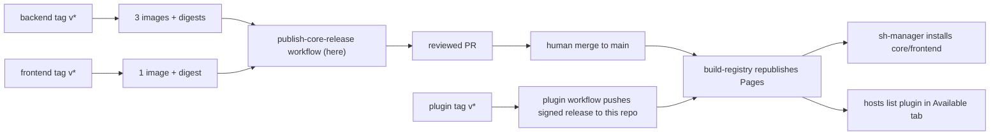

<!--
SPDX-FileCopyrightText: 2026 Humdek, University of Bern
SPDX-License-Identifier: MPL-2.0
-->

# Release runbook (step by step)

Audience: Release engineers and maintainers, including first-time publishers.
Status: active.
Applies to: `sh2-plugin-registry`, `sh-selfhelp_backend`, `sh-selfhelp_frontend`, and every plugin repo (for example `sh2-shp-survey-js`).
Last verified: 2026-06-10.
Source of truth: `.github/workflows/publish-core-release.yml`, `.github/workflows/build-registry.yml`, `scripts/publish-release.mjs`, `scripts/sign-release.mjs`, `keys/trusted-keys.json`, backend `.github/workflows/docker-release.yml`, frontend `.github/workflows/frontend-release.yml`, and the plugin `publish-to-registry.yml` workflows.

This is the "do this, then this" guide. It answers four questions:

1. **When do I create a tag, and in which repo?**
2. **What happens automatically after each tag?**
3. **How does a release end up in this registry (and on hosts/managers)?**
4. **Which keys and secrets do I need, and where does each one live?**

Deep background lives in [publishing.md](publishing.md) (full publishing
reference) and [signing.md](signing.md) (trust model). You do not need them to
follow this page.

## 1. The big picture

There are exactly three kinds of releases. Each starts with a git tag (or one
manual workflow run) and ends with content served by this registry's GitHub
Pages site:

| What changed? | Where you act | What happens automatically | What you still do by hand |
| --- | --- | --- | --- |
| Backend code (Symfony) | Tag `v<version>` in `sh-selfhelp_backend` | `docker-release.yml` builds + pushes 3 images (`selfhelp-backend`, `selfhelp-worker`, `selfhelp-scheduler`) to GHCR and prints their digests | Publish a **core** release here (step 4) |
| Frontend code (Next.js) | Tag `v<version>` in `sh-selfhelp_frontend` | `frontend-release.yml` builds + pushes `selfhelp-frontend` to GHCR and prints its digest | Publish a **frontend** release here (step 4) |
| A plugin (for example SurveyJS) | Tag `v<version>` in the plugin repo | `publish-to-registry.yml` builds the signed `.shplugin`, pushes manifest + artifact + signed release doc into this repo, creates the GitHub Release, and Pages republishes | Nothing. Hosts see the new version in **Admin -> Plugins -> Available** |



Two rules to remember:

- **Images first, registry second.** A core/frontend release in this registry
  only points at image digests, so the images must exist before you publish.
- **Nothing platform-related goes public without a human merge.** The
  `publish-core-release` workflow only opens a PR. Plugins are the exception:
  a plugin tag publishes straight through (that is by design).

## 2. One-time setup: the keys and secrets

You only do this once (and again on key rotation). If this is already set up,
jump to [section 3](#3-release-order-cheat-sheet).

### 2.1 The one Ed25519 signing keypair

One keypair signs **everything**: `.shplugin` archives, plugin release
documents, and core/frontend/scheduler/worker release documents.

Generate it once (prints `publicKey` + `privateKey`, both base64):

```bash
cd sh2-plugin-registry   # local clone of this repo (folder name may differ)
npm install
npm run keygen
```

> **Already have a keypair?** If you generated one earlier for plugin
> publishing (for example for `sh2-shp-survey-js`), **reuse it — it is the
> same kind of key.** Do not generate a second keypair unless you are
> deliberately rotating. The standard SelfHelp key uses keyId `prod`, and its
> public half is already the default in the backend's
> `SELFHELP_PLUGIN_TRUSTED_KEYS` env and in this repo's
> `keys/trusted-keys.json`.

The two halves go to different places:

| Half | Secret? | Goes to |
| --- | --- | --- |
| `privateKey` | YES — never commit, never log | GitHub Actions secret `SELFHELP_SIGNING_KEY` in **this repo** and in **every plugin repo** |
| keyId (for example `prod`) | No, but paired with the private key | GitHub Actions secret `SELFHELP_SIGNING_KEY_ID` next to the private key |
| `publicKey` | No | 1. `keys/trusted-keys.json` in this repo (entry with the same keyId, `status: "active"`); 2. every host's `SELFHELP_PLUGIN_TRUSTED_KEYS=<keyId>=<base64-public>` env; 3. the manager's trusted-keys file |

### 2.2 Secrets checklist per repository

| Repository | Secret | Required for | Notes |
| --- | --- | --- | --- |
| `sh2-plugin-registry` | `SELFHELP_SIGNING_KEY` | Signing core/frontend/scheduler/worker releases | Without it, `publish-core-release` **fails on purpose** for every channel except `test` |
| `sh2-plugin-registry` | `SELFHELP_SIGNING_KEY_ID` | Same | Must match a `keyId` in `keys/trusted-keys.json`, otherwise `validate:unified` rejects the signature |
| every plugin repo | `SELFHELP_SIGNING_KEY` + `SELFHELP_SIGNING_KEY_ID` | Signing the `.shplugin` + the plugin release doc | **If missing, the workflow silently falls back to the public dev key** — the release works but is not production-trusted |
| every plugin repo | `REGISTRY_PUSH_TOKEN` | Letting the plugin workflow push into this repo | Fine-grained PAT, *Contents: Read and write*, scoped to `humdek-unibe-ch/sh2-plugin-registry` only. Without it the plugin still builds + attaches the GitHub Release, but the registry is NOT updated |
| `sh-selfhelp_backend`, `sh-selfhelp_frontend` | `COSIGN_PRIVATE_KEY` + `COSIGN_PASSWORD` | Optional cosign image signing | If absent, the backend signs keyless via GitHub OIDC and the frontend skips signing |

Step-by-step screenshots for the plugin secrets are in the SurveyJS repo:
[`docs/operations/secrets-setup.md`](https://github.com/humdek-unibe-ch/sh2-shp-survey-js/blob/main/docs/operations/secrets-setup.md).

### 2.3 Repository settings (GitHub UI, once)

- This repo: **Settings -> Pages -> Build and deployment -> Source = GitHub
  Actions** (otherwise nothing ever goes live).
- This repo: **Settings -> Actions -> General -> Workflow permissions ->
  "Allow GitHub Actions to create and approve pull requests"** must be ON
  (otherwise the `publish-core-release` workflow cannot open its PR).

### 2.4 Trusted keys in this repo

`keys/trusted-keys.json` lists the public keys that releases may be signed
with. It currently contains:

- `prod` — the production publishing key. Its public half ships as the
  default trusted key on every host (backend `.env.default`
  `SELFHELP_PLUGIN_TRUSTED_KEYS`).
- `selfhelp-official-2026` — the deterministic **bootstrap/dev key** (derived
  from a public seed; anyone can reproduce it). The committed `0.1.0` platform
  releases and early plugin releases were signed with it. After every release
  document has been re-published with the `prod` key, flip this entry to
  `"status": "revoked"` — do not revoke it earlier or `validate:unified` will
  fail on the still-dev-signed documents.

To rotate keys later: generate a new pair, ADD its public key here (keep the
old one active), switch the CI secrets, wait until everything you care about
is re-signed, then revoke the old entry. Details: [signing.md](signing.md).

## 3. Release order cheat sheet

For a coordinated "everything changed" wave:

1. **Merge code to `main` in every repo first** — in the documented merge
   order (backend -> shared + registry -> frontend + mobile -> manager ->
   plugins). See backend
   [`docs/developer/branch-merge-order.md`](https://github.com/humdek-unibe-ch/sh-selfhelp_backend/blob/main/docs/developer/branch-merge-order.md).
2. **Tag the backend** -> wait for green -> copy 3 digests.
3. **Tag the frontend** -> wait for green -> copy 1 digest.
4. **Run `publish-core-release` here** — once for `core`, once for
   `frontend` -> review PR(s) -> merge -> Pages republish.
5. **Tag plugins** (if any changed) -> fully automatic.

Only releasing one thing? Do just its steps — the three release types are
independent. Scheduler and worker images ship inside the **core** release
(their digests are part of it); publish the separate `scheduler` / `worker`
kinds only when you intentionally pin one of them to a different version.

## 4. Step-by-step: full platform release

### Step 1 — release the backend images

When: backend code changed and you want a new installable core version.

```bash
cd sh-selfhelp_backend
# 1. Make sure main is green and CHANGELOG.md covers the version.
git checkout main && git pull
# 2. Tag and push. The tag IS the image version (v0.2.0 -> images :0.2.0).
git tag v0.2.0
git push origin v0.2.0
```

What runs: `docker-release.yml` — license gate, then builds + pushes
`selfhelp-backend`, `selfhelp-worker`, `selfhelp-scheduler` to
`ghcr.io/humdek-unibe-ch/...`, generates SBOMs, runs the Trivy scan, signs the
digests.

**Collect:** open the finished run -> **Summary** -> copy the three
`digest: sha256:...` values (backend / worker / scheduler). Digests, not tags,
are what make a release reproducible.

### Step 2 — release the frontend image

When: frontend code changed.

```bash
cd sh-selfhelp_frontend
git checkout main && git pull
# 1. The workflow HARD-FAILS if the tag does not match package.json version.
npm version 0.2.0 --no-git-tag-version   # or edit package.json manually
git add package.json package-lock.json && git commit -m "release: 0.2.0"
git push
# 2. Tag and push.
git tag v0.2.0
git push origin v0.2.0
```

What runs: `frontend-release.yml` — builds + pushes
`ghcr.io/humdek-unibe-ch/selfhelp-frontend:0.2.0`, SBOM, Trivy scan, and
attaches an unsigned `frontend-release.json` descriptor to the GitHub Release.

**Collect:** the image `digest: sha256:...` from the run output (or run
`docker buildx imagetools inspect ghcr.io/humdek-unibe-ch/selfhelp-frontend:0.2.0`).

### Step 3 — publish the core release (in this repo)

GitHub -> `sh2-plugin-registry` -> **Actions -> publish-core-release -> Run
workflow**, fill in:

| Input | Example | Notes |
| --- | --- | --- |
| `kind` | `core` | |
| `version` | `0.2.0` | Same version you tagged the backend with |
| `channel` | `stable` | `stable` REQUIRES the production signing secrets; use `test` only for rehearsal |
| `seed_from` | `releases/core/selfhelp-core-0.1.0.json` | Recommended: copies runtime/database fields you do not want to retype |
| `digests` | `{"backend":"sha256:...","worker":"sha256:...","scheduler":"sha256:..."}` | The three digests from step 1 |
| `metadata` | `{"minUpgradeFrom":"0.1.0","migrationRange":"Version20260501000000..Version20260605081254"}` | Optional; anything not given comes from `seed_from` |

The workflow assembles `releases/core/selfhelp-core-0.2.0.json`, signs it with
the production key, adds the ref to `registry.json`, re-validates everything,
and opens a PR on branch `publish/core-0.2.0`. **It never publishes by
itself.**

### Step 4 — publish the frontend release

Same as step 3 with:

- `kind` = `frontend`, `version` = `0.2.0`
- `digests` = `{"image":"sha256:..."}` (from step 2)
- `metadata` = `{"requiredCoreRange":">=0.2.0 <0.3.0"}` — which core versions
  this frontend works with

### Step 5 — review and merge the PR(s)

Open the PR and check the boxes in its description:

- [ ] Digests in the release JSON == digests printed by the image pipelines.
- [ ] `validate:unified` green (schema + signature re-verified).
- [ ] `guard:trust` green.
- [ ] `channel` is correct (`stable` only with the production key).

Merge. The merge to `main` triggers `build-registry.yml`, which validates
again and republishes GitHub Pages.

### Step 6 — verify

- <https://humdek-unibe-ch.github.io/sh2-plugin-registry/registry.json> lists
  the new version under `core[]` / `frontend[]`.
- The manager (`sh-manager`) sees the release on its next registry refresh and
  can install/update instances to it.

## 5. Step-by-step: plugin release (example: SurveyJS)

When: any plugin change you want hosts to see. Everything after the tag is
automatic.

```bash
cd sh2-shp-survey-js
# 1. Bump the version in plugin.json (and keep CHANGELOG.md in sync —
#    the GitHub Release body is extracted from the matching section).
#    Version semantics: patch = code only, minor = has a DB migration,
#    major = breaking (pluginApiVersion / compatibility changes).
# 2. Commit, push, wait for green.
git add -A && git commit -m "release: 0.3.0" && git push
# 3. Tag (must match plugin.json version) and push the tag.
git tag v0.3.0
git push origin v0.3.0
```

What runs (`publish-to-registry.yml` in the plugin repo):

1. Validates `plugin.json` against the canonical manifest schema.
2. Builds the frontend runtime + the signed `.shplugin` archives.
3. Pushes into this registry repo: `manifests/<id>-0.3.0.json`,
   `artifacts/<id>-0.3.0.shplugin`, signed
   `releases/plugins/<id>-0.3.0.json`, and the new ref in `registry.json`
   (older versions stay listed — hosts pick the newest compatible one).
4. Creates the GitHub Release with the standalone `.shplugin` attached (for
   offline drag-and-drop installs).
5. This repo's `build-registry.yml` validates and republishes Pages.

**Verify:** the new version appears in `registry.json` `plugins[]`, and a host
with the `humdek-public` source shows it under **Admin -> Plugins ->
Available** on the next refresh.

## 6. When do I tag what?

| Situation | Tag backend? | Tag frontend? | Registry workflow? | Tag plugin? |
| --- | --- | --- | --- | --- |
| Backend-only fix/feature | Yes | No | `core` | No |
| Frontend-only fix/feature | No | Yes | `frontend` | No |
| Coordinated platform wave | Yes | Yes | `core` + `frontend` | If changed |
| Plugin-only change | No | No | No (automatic) | Yes |
| Docs-only change anywhere | No | No | No | No |

Versioning rules while the platform is pre-1.0 (`0.x`): every **minor** is
allowed to be breaking; tag versions always equal the version inside the repo
(`package.json` for frontend, `plugin.json` for plugins). Plugin semantics:
**patch** = code only, **minor** = ships a DB migration, **major** = breaking
change.

## 7. Troubleshooting

| Symptom | Cause | Fix |
| --- | --- | --- |
| `publish-core-release` fails at "Refuse to dev-sign a non-test release" | `SELFHELP_SIGNING_KEY` / `..._KEY_ID` secrets are not set in this repo | Add the secrets (section 2.2), or use `channel: test` for a rehearsal |
| `publish-core-release` failed at the same step BEFORE 2026-06-10 even with secrets set | Workflow bug: the guard read the `secrets` context inside a step `if:`, where it is always empty | Fixed in the workflow (secrets are now job-scoped env). Re-run on the current `main` |
| `publish-core-release` fails at "Open reviewed pull request" with "GitHub Actions is not permitted to create ... pull requests" | Repo setting is off | Settings -> Actions -> General -> enable "Allow GitHub Actions to create and approve pull requests" |
| `validate:unified` fails with `no active trusted key for keyId "..."` | The keyId in the secrets has no matching public key in `keys/trusted-keys.json` | Add the public key with that keyId (PR), then re-run |
| `validate:unified` fails with `signature verification failed` | Private key in the secret does not match the public key in `keys/trusted-keys.json` for that keyId | Fix the secret (or the trusted-keys entry) so the pair matches |
| Plugin workflow warns `REGISTRY_PUSH_TOKEN secret is not set` | Token missing in the plugin repo | The `.shplugin` + GitHub Release still happen; add the PAT to also update the registry, then re-run the workflow |
| Plugin published but signed with `keyId: selfhelp-official-2026` | Plugin repo signing secrets missing, so CI fell back to the dev key | Add `SELFHELP_SIGNING_KEY` + `..._KEY_ID` to the plugin repo, bump the version, re-tag |
| Frontend release fails at "Resolve version" | Tag does not match `package.json` version | Bump `package.json`, push, re-tag |
| Host says `signature key not trusted (keyId=...)` on plugin install | Host env lacks the public key | Add `SELFHELP_PLUGIN_TRUSTED_KEYS=<keyId>=<base64-public>` on the host and restart PHP |
| Pages site never updates after merge | GitHub Pages not enabled with the Actions source | Settings -> Pages -> Source = GitHub Actions |
| Trivy scan step fails to resolve the action | A pre-`0.35.0` `trivy-action` tag (those tags were removed after the March 2026 supply-chain incident) | Pin `aquasecurity/trivy-action` to the `0.35.0` commit SHA (already done in backend/frontend release workflows) |

## 8. See also

- [publishing.md](publishing.md) — full publishing reference (plugin entries, platform releases, advisories, trusted keys).
- [signing.md](signing.md) — the Ed25519 trust model, key generation, rotation.
- [reference/registry-layout.md](../reference/registry-layout.md) — what every file in this repo is.
- Backend [`docs/operations/docker-release-pipeline.md`](https://github.com/humdek-unibe-ch/sh-selfhelp_backend/blob/main/docs/operations/docker-release-pipeline.md) — how the three backend images are built.
- SurveyJS [`docs/operations/secrets-setup.md`](https://github.com/humdek-unibe-ch/sh2-shp-survey-js/blob/main/docs/operations/secrets-setup.md) — plugin secrets with screenshots-level detail.
- Manager [`docs/release-publishing.md`](https://github.com/humdek-unibe-ch/sh-manager/blob/main/docs/release-publishing.md) — how the manager consumes these releases; rehearsal runbook on the `test` channel.
