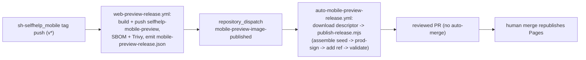

# Mobile-preview release kind (`selfhelp-mobile-preview`)

Audience: Registry maintainers and SelfHelp Manager developers.
Status: active.
Applies to: `sh2-plugin-registry`, `sh-selfhelp_mobile`, `sh-manager`.
Last verified: 2026-06-23.
Source of truth: `mobile-preview-release.schema.json`, `registry.schema.json`, `scripts/assemble-release.mjs` (`buildMobilePreview`), `scripts/publish-release.mjs`, `.github/workflows/auto-mobile-preview-release.yml`, and `sh-selfhelp_mobile/.github/workflows/web-preview-release.yml`.

The `selfhelp-mobile-preview` image is the Expo **web export** of the SelfHelp
mobile app, served behind the CMS (under `/mobile-preview`, talking to the
private backend through a same-origin proxy) so an admin can preview the **mobile
rendering** of a page in-browser with live device frames. It is published like
the other Docker artifacts: a digest-pinned image plus a signed release document
referenced from `registry.json`.

This is **not** the EAS app binary. The actual installable mobile app is the
design-only `selfhelp-mobile-release` kind (EAS build + OTA, per-instance bundle);
see [mobile-release.md](mobile-release.md). The two never share a release document.

## Release document fields

A `releases/mobile-preview/<id>.json` document carries the frontend release shape
plus two mobile-specific fields (schema: `mobile-preview-release.schema.json`):

| Field | Description |
| --- | --- |
| `kind` | Always `selfhelp-mobile-preview-release`. |
| `id`, `version`, `channel` | Match the ref in `registry.json` `mobilePreview[]`. `id` is `selfhelp-mobile-preview-<version>`. |
| `image`, `digest` | The `ghcr.io/<owner>/selfhelp-mobile-preview:<version>` image and its `sha256:` digest the manager pins. |
| `builtFrom` | Build provenance such as `{sharedPackageVersion, expoSdk, reactNative}`. |
| `backendCompatibility` | `{requiredCoreRange, requiredApiVersion}` — the backend (`core`) range + API version the image needs (it calls the private `/cms-api` through its proxy). |
| `mobileRendererVersion` | The mobile renderer contract the image is built against, mirroring `@selfhelp/shared` `MOBILE_RENDERER_VERSION`. Plugin `compatibility.mobile` ranges gate against this. |
| `reactNativeVersion` | React Native version in the preview image. Plugin `compatibility.reactNative` ranges gate against this. May be derived from `builtFrom.reactNative` by the auto workflow. |
| `expoSdkVersion` | Expo SDK version in the preview image. Plugin `compatibility.expoSdk` ranges gate against this. May be derived from `builtFrom.expoSdk` by the auto workflow. |
| `bundledPlugins[]` | The curated official-plugin packages baked into the image: `{id, version, mobilePackage, mobilePackageVersion}`. Every other plugin falls back to the in-preview "open on web" deep link. |
| `security` | `{signature, keyId, signedPayloadSha256}` — Ed25519 over the canonical JSON of the document **without** `security` (byte-identical to every other signed release here). |

## Registry index ref

`registry.json` carries one ref per published version under the optional
`mobilePreview[]` array (additive — bumps `registry.schemaVersion` to `1.1`):

```jsonc
{
  "schemaVersion": "1.1",
  "mobilePreview": [
    {
      "id": "selfhelp-mobile-preview-0.2.0",
      "version": "0.2.0",
      "channel": "stable",
      "releaseUrl": "releases/mobile-preview/selfhelp-mobile-preview-0.2.0.json"
    }
  ]
}
```

`validate:unified` validates each ref's document against
`mobile-preview-release.schema.json` and Ed25519-verifies it against
`keys/trusted-keys.json`, exactly like the other kinds.

## How it is published

The mobile repo builds the image and emits an **unsigned** descriptor; the
registry seeds the signed release from it (it never re-derives the bundled set or
the renderer contract — those are image-built facts):



- The mobile workflow attaches `mobile-preview-release.json` to its GitHub
  release and dispatches `mobile-preview-image-published` with
  `client_payload: {kind, version, repo, digests:{image}}` (needs the optional
  `REGISTRY_DISPATCH_TOKEN` secret in the mobile repo).
- `auto-mobile-preview-release.yml` downloads that descriptor, cross-checks the
  payload digest against it (mismatch = hard fail), and runs the **same**
  `publish-release.mjs` chain as every other kind, seeding `bundledPlugins` +
  `mobileRendererVersion`, `reactNativeVersion`, and `expoSdkVersion` from the
  descriptor (`PUBLISH_SEED_FROM`). It opens a
  reviewed PR on `publish/mobile-preview-<version>`; a human merge republishes
  Pages.
- This kind intentionally does **not** flow through
  `resolve-core-candidate.mjs`. Core/frontend releases need bidirectional
  counterpart pairing; a mobile-preview release is a single descriptor that
  already declares its backend floor, renderer contract, RN/Expo versions, and
  bundled plugin set. The Manager later pairs it with core by
  `backendCompatibility.requiredCoreRange`.
- Manual path: **Actions → publish-core-release → Run workflow** with
  `kind = mobile-preview`, the `seed_from` pointing at the downloaded descriptor,
  `digests = {"image":"sha256:…"}`, and
  `metadata = {"mobileRendererVersion","reactNativeVersion","expoSdkVersion","sharedPackageVersion","requiredCoreRange","requiredApiVersion"}`.

## Channels

Same convention as every other kind: `stable` (production, real key only),
`beta`, `nightly`, `test` (rehearsal). The publish workflow refuses to dev-sign a
non-`test` channel.
